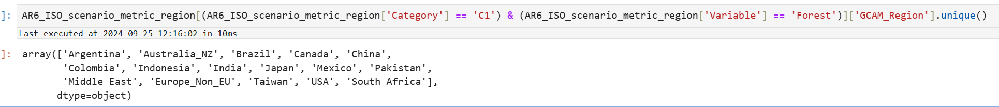

# Demeter for AR6: Method  ＆ Question

# File description

| gcam_ref_scenario_reg32_basin235_v5p1p3 | Default projection file in Demeter |  |
| --- | --- | --- |
| AR6_Scenarios_Database_metadata_indicators_v1.1 | For introductory information on the AR6 dataset |  |
| AR6_Scenarios_Database_ISO3_v1.1 | AR6 dataset, which includes projections of land-use change at the national scale | [AR6 Scenario Explorer and Database hosted by IIASA](https://data.ece.iiasa.ac.at/ar6/#/downloads) Here is the download link |
| basin_to_country_mapping | Mapping file in GCAM core for mapping from relationships between national and basin |  |
| GCAM_regino_mapping | GCAM mapping file for mapping between GCAM regions and countries |  |

# Q1:Discussion

We note that not all of the GCAM region will be planted in the C1 scenario. However, inside the Demeter Projected data there are Forest changes in each region. How does this need to be considered?

# **Q2.Weights for assigning basins to each country**

Since AR6 only provides values for each country, but we want to assign a basin in GCAM for Demeter.

The solution we have used is

We summed the 1975-2015 values for each BASIN section.

 For the assignment of weights we use

Is there a better way to improve it? Or a simpler process?

# 2024/10/5 Update

# Q3.Demeter landclasses are missing when allocating AR6 landclasses (corresponding landclasses are sparse and snow).

This picture form ***Projected land class allocation section(***[JGCRI/demeter: A land use land cover disaggregation and change detection model (github.com)](https://github.com/JGCRI/demeter)***)This means we can define the classes we want to merge.This would solve the first problem I raised earlier.***

However, there are no land attributes for snow in the AR6 land use data.

The solution

We consider “other land ” in AR6 database to be “sparse”, and we copied the Tundra land class from the projected ref table in Demeter as snow landclass.

# Q4.AR6's area units don't match Demeter's area units

The unit of area in AR6 is million hectares, but the unit in Demeter is square kilometres (my guess based on the configuration file). The difference between them is 10000. but after I processed the cropland, there is still a difference in magnitude between Demeter and AR6 data.

The red boxes represent Demeter data (in square kilometres) and the blue boxes represent AR6 data (in millions of hectares).